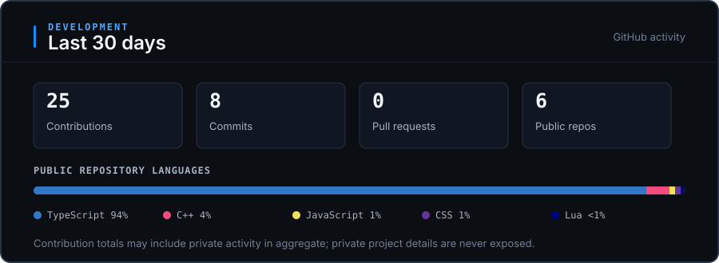

# Vincent

**Software · Web · Automation**

Self-taught developer from Germany building software, web experiences and automation.

Building projects under [CENVALO](https://eclipse-dev.de).

[CENVALO](https://eclipse-dev.de) · [TikTok](https://www.tiktok.com/@cenvaloservices)

## Selected work

### [Project Hub Desktop](https://github.com/Vincent-Cenvalo/project-hub-desktop)

Local Electron workspace for keeping project context, tasks and development notes together.

`TypeScript · Electron · React · SQLite · C++`

### [Service Status Dashboard](https://github.com/Vincent-Cenvalo/service-status-dashboard)

React status history view with explicit availability states and responsive latency charts.

`TypeScript · React · Vite`

### [Discord Event Guards](https://github.com/Vincent-Cenvalo/discord-event-guards)

Dependency-free Node.js utilities for coalescing Discord events and tracking bot-owned operations.

`JavaScript · Node.js`

### [FiveM Duty Sessions](https://github.com/Vincent-Cenvalo/fivem-duty-sessions)

Server-side duty tracking with ACE permissions, persistent sessions and restart recovery.

`Lua · FiveM`

## Development

<picture>
  
</picture>

View development activity details

The figures use GitHub's rolling 30-day contribution totals. Language distribution is calculated only from public repositories owned by this account, excluding forks. Private repository names and contents are never included.

## Current focus

- **CENVALO** — Building internal tools and practical development workflows.
- **Project Hub** — Desktop tooling around project context and development sessions.
- **Automation** — Tools for development, Discord workflows and infrastructure tasks.

## Tech and workflow

`TypeScript` `JavaScript` `React` `Next.js` `Node.js` `PostgreSQL` `Electron` `SQLite` `Python` `Lua` `C++`

Modern AI tools support my workflow across ideation, planning, design exploration and development.

Some repositories are focused, public-safe extracts from larger private projects.

---

**[CENVALO](https://eclipse-dev.de)** — Building useful software, web experiences and automation.
